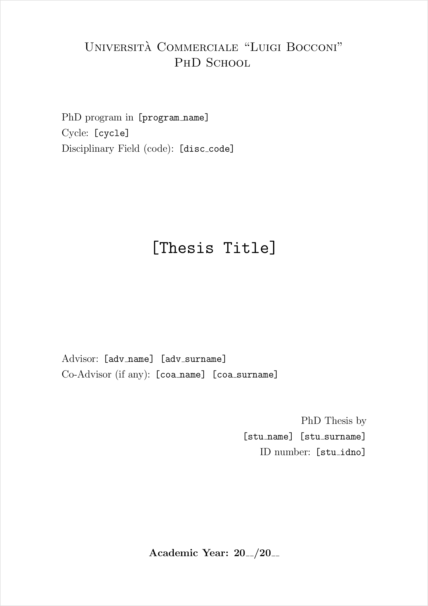

# Title Page for PhD Thesis at Bocconi University

This repo contains simple LaTeX code to create a title page that suits the requirements of the PhD School at Bocconi University.

The University offers a Microsoft Word template ([download](https://www.unibocconi.eu/wps/wcm/connect/cb8e0180-a88d-41e6-873d-1f3d1243390b/Thesis+cover+template_ENG_july19.doc?MOD=AJPERES&CVID=mKjwLan)), together with other typographic instructions at their [dedicated webpage](https://www.unibocconi.eu/wps/wcm/connect/bocconi/sitopubblico_en/navigation+tree/home/programs/phd/phd+in+economics+and+finance/info+for+current+students/phd+thesis+instructions+and+deadlines+ecofin).
However, I work with [LaTeX](https://www.latex-project.org/) and I need to code up the title page from scratch.
So I put this here in the hope that it can be useful to somebody else.

## Usage

The file `coverpage.tex` is intended for use with the `\input` command in LaTeX.
This corresponds to copy-pasting the code into the `.tex` file you compile.
Note that the line

    \input{coverpage}

_substitutes_ the line

    \maketitle

in your LaTeX root file, otherwise you will have both the title page and the usual title (which depends on the document class you use).

## Blank spaces (to be filled in)

The file `coverpage.tex` is a template.
Information displayed in typewriter style (`\texttt`) surrounded in square brackets must be filled in by the user.

To give an understanding of how to fill in the information, I provide an example with my own data.
Italicized words are comments.

- `program_name`: Economics and Finance
- `cycle`: 31st _(as I enrolled in a.y. 2015/2016)_
- `disc_code`: _I don't know yet_
- `adv_name` and `adv_surname`: Basile Grassi
- `coa_name` and `coa_surname`: _none in my case_
- `stu_name` and `stu_surname`: Andrea Pasqualini
- `stu_idno`: 3006510
- Academic Year: 2019/2020 _(the one after the last year of enrollment)_

## Implementation details

The Word file Bocconi offers consists of a single A4 page with left and right margins set to 2 cm and top and bottom margins set to 1 cm.
There are three font sizes: 14 pts as default size, 16 pts for the page header and 22 pts for the thesis title.
The following table shows how I matched the font sizes in Word to font sizes in LaTeX.
The third column assumes that the `\normalsize` set in LaTeX is 11 pts.

| Word file | LaTeX command | PDF (LaTeX) file        |
|-----------|---------------|-------------------------|
| 14 pts    | `\Large`      | 14 pts                  |
| 16 pts    | `\LARGE`      | 17 pts                  |
| 22 pts    | `\Huge`       | 25 pts                  |

I eyeballed the vertical space in the Word file.
In LaTeX, I set 1.5 cm of vertical space (`\vspace`) between the header and the info on the PhD program and between the info on advisors and info on the graduating student.
The remaining vertical space is made of elastic space (`\vfill`) so that the content spans the entire vertical space on the page.

## Generating preview files

The PDF file in the `preview` folder is generated with `pdflatex`.
Then I used [ImageMagick](https://imagemagick.org/index.php) to convert the PDF file to a PNG file displayed above.
In summary

    pdflatex preview.tex
    convert -density 192 preview.pdf -quality 100 -layers flatten -border 2 -bordercolor black preview.png

where

- `-density 192` set rasterized output to 192 pixels per inch
- `-quality 100` suppresses any image compression
- `-layers flatten` prevents white color on PDF from being set to transparent in PNG file
- `-border 2` sets a 2-pixel frame around the output image
- `-bordercolor black` sets the frame color to black

## Licensing

This code is released under the [_Do What The Fuck You Want To Public License_ (WTFPL)](https://choosealicense.com/licenses/wtfpl/).
